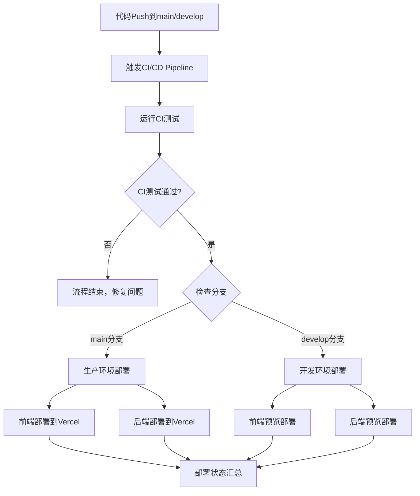

# DouDou 项目 GitHub Actions 工作流说明

## 📁 目录结构

```
.github/
├── workflows/              # GitHub Actions 工作流
│   ├── pipeline.yml         # 统一CI/CD流程 ✨
│   └── README.md           # 工作流说明文档
├── ISSUE_TEMPLATE/         # Issue 模板
│   ├── bug_report.yml      # Bug 报告模板
│   └── feature_request.yml # 功能请求模板
├── dependabot.yml          # 依赖自动更新配置
├── pull_request_template.md # PR 模板
└── README.md              # 本文档
```

---

## ⚙️ GitHub 配置要求

### 必需的配置

#### A. GitHub Secrets 配置

**访问路径**: `仓库设置 → Secrets and variables → Actions`

```yaml
必需的 Secrets:
└── Vercel 部署配置
    └── VERCEL_TOKEN=your_vercel_token
```

**获取VERCEL_TOKEN步骤**：
1. 访问 [Vercel Dashboard](https://vercel.com/account/tokens)
2. 创建新的Token
3. 复制Token值到GitHub Secrets中

#### B. 分支保护规则 (推荐)

**访问路径**: `仓库设置 → Branches → Add rule`

```yaml
分支: main
保护规则:
├── ✅ Require a pull request before merging
├── ✅ Require status checks to pass before merging
│   └── 选择: 运行CI测试
├── ✅ Require branches to be up to date before merging
└── ✅ Include administrators
```

#### C. 启用 Dependabot

**访问路径**: `仓库设置 → Security → Code security and analysis`

```yaml
需要启用的功能:
├── ✅ Dependabot alerts
├── ✅ Dependabot security updates
└── ✅ Dependabot version updates
```

### 重要配置说明

#### Vercel项目配置
- **关闭Vercel自动部署**: 在Vercel Dashboard中关闭Git集成的自动部署
- **使用GitHub Actions部署**: 通过CI/CD流程统一管理部署
- **项目检测**: Vercel会通过Git连接自动检测项目，无需手动配置ORG_ID和PROJECT_ID

---

## 🔄 CI/CD 工作流程

### 统一Pipeline架构



### 分支策略

| 分支 | CI触发 | 部署环境 | 说明 |
|-----|--------|----------|------|
| `main` | ✅ | Production | 自动部署到生产环境 |
| `develop` | ✅ | Preview | 自动部署到预览环境 |
| `feature/*` | ❌ | - | 创建PR合并到develop |

---

## 🛠️ 技术实现

### 核心特性
- **单一工作流**: CI+CD集成在pipeline.yml中
- **原生CLI部署**: 使用最新Vercel CLI，避免第三方Action限制
- **智能构建**: 针对Vercel环境优化的构建脚本
- **非交互式**: 完全自动化，无人工干预需求

### 部署技术栈
- **前端**: Next.js → Vercel
- **后端**: FastAPI → Vercel Functions
- **CI/CD**: GitHub Actions
- **依赖管理**: npm + package-lock.json同步

### 已解决的技术难题
1. **workflow_run触发器secrets访问限制** → 改用push触发器
2. **Vercel CLI交互式确认卡死** → 使用管道输入自动确认
3. **ESLint版本不匹配构建失败** → 版本同步 + 无lint构建脚本
4. **npm ci依赖冲突** → package-lock.json重新生成

---

## 📊 监控和维护

### 工作流状态检查
- **位置**: GitHub仓库 → Actions页面
- **工作流名称**: "CI/CD Pipeline"
- **监控内容**: CI测试、部署状态、健康检查

### 常见操作
- **手动触发**: Actions页面 → CI/CD Pipeline → Run workflow
- **查看日志**: 点击具体的workflow run查看详细日志
- **调试问题**: 所有步骤在一个工作流中，便于统一排查

### 维护建议
- **定期更新依赖**: Dependabot会自动创建PR
- **监控部署状态**: 关注Actions页面的运行状态
- **保持secrets更新**: 定期轮换VERCEL_TOKEN

---

## 🔧 自定义和扩展

### 修改CI检查
编辑 `pipeline.yml` 中的 `run-ci` job:
```yaml
- name: 运行CI测试
  run: |
    npm run lint      # ESLint检查
    npm run test:ci   # Jest测试
    npm run build     # Next.js构建
```

### 修改部署流程
编辑 `pipeline.yml` 中的部署jobs:
- `deploy-production`: 生产环境部署配置
- `deploy-development`: 开发环境部署配置

### 添加新环境
1. 在 `pipeline.yml` 中复制现有部署job
2. 修改触发条件和环境变量
3. 在GitHub Secrets中添加相应配置

---

## 🚀 快速开始

1. **确保配置完成**: 检查GitHub Secrets中的VERCEL_TOKEN
2. **推送代码**: 推送到main或develop分支
3. **监控部署**: 在Actions页面查看部署进度
4. **访问应用**: 部署完成后通过Vercel提供的URL访问

### 首次部署检查清单
- [ ] VERCEL_TOKEN已配置
- [ ] Vercel项目已连接GitHub
- [ ] 分支保护规则已设置
- [ ] Dependabot已启用
- [ ] 代码推送到main/develop分支
- [ ] GitHub Actions运行成功
- [ ] 应用可正常访问