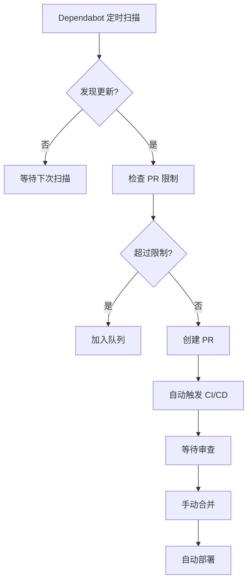
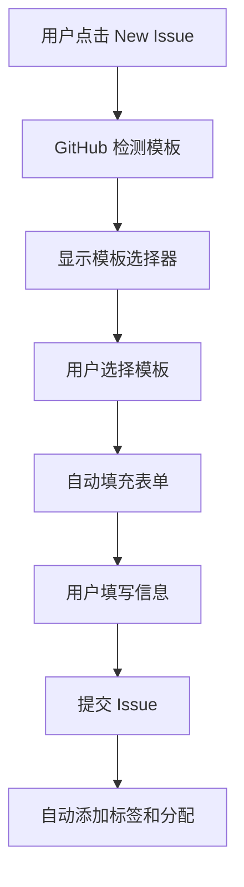

# DouDou 项目 GitHub Actions 工作流说明

## 📁 目录结构

```
.github/
├── workflows/              # GitHub Actions 工作流
│   ├── ci-cd.yml           # 主 CI/CD 流程
│   └── code-quality.yml    # 代码质量与安全扫描
├── ISSUE_TEMPLATE/         # Issue 模板
│   ├── bug_report.yml      # Bug 报告模板
│   └── feature_request.yml # 功能请求模板
├── dependabot.yml          # 依赖自动更新配置
├── pull_request_template.md # PR 模板
└── README.md              # 本文档
```

---

## ⚙️ GitHub 配置要求

### 必需的配置

#### A. GitHub Secrets 配置
**访问路径**: `仓库设置 → Secrets and variables → Actions`

```yaml
必需的 Secrets:
├── Vercel 部署配置
│   ├── VERCEL_TOKEN=your_vercel_token
│   ├── VERCEL_ORG_ID=your_vercel_org_id  
│   └── VERCEL_PROJECT_ID=your_vercel_project_id
├── Railway 部署配置
│   ├── RAILWAY_TOKEN=your_railway_token
│   ├── RAILWAY_SERVICE_ID=your_railway_service_id
│   └── RAILWAY_APP_URL=https://your-app.railway.app
├── 数据库配置
│   └── DATABASE_URL=your_production_database_url
└── 其他环境变量
    ├── TENCENT_COS_SECRET_ID=your_cos_secret_id
    └── TENCENT_COS_SECRET_KEY=your_cos_secret_key
```

#### B. 分支保护规则 (推荐)
**访问路径**: `仓库设置 → Branches → Add rule`

```yaml
分支: main
保护规则:
├── ✅ Require a pull request before merging
├── ✅ Require status checks to pass before merging
│   └── 选择: frontend-test, backend-test
├── ✅ Require branches to be up to date before merging
└── ✅ Include administrators
```

#### C. 启用 Dependabot
**访问路径**: `仓库设置 → Security → Code security and analysis`

```yaml
需要启用的功能:
├── ✅ Dependabot alerts
├── ✅ Dependabot security updates  
└── ✅ Dependabot version updates
```

### 可选的配置

#### A. 环境配置 (高级)
**访问路径**: `仓库设置 → Environments`

```yaml
创建环境:
├── production
│   ├── 保护规则: 需要审查者批准
│   └── 环境变量: 生产环境密钥
└── development  
    ├── 保护规则: 无
    └── 环境变量: 开发环境密钥
```

#### B. 通知集成 (可选)
```yaml
Slack 集成:
├── 安装 GitHub App 到 Slack
├── 配置 Webhook URL
└── 添加到 SLACK_WEBHOOK secret
```

ps: 引入CID/CD工作流后，需要关闭vercel自动部署

---

## 🔄 核心执行机制

### 1. 工作流触发系统

#### 事件驱动架构

**主 CI/CD 工作流 (ci-cd.yml)**
```yaml
触发条件:
├── push 事件
│   ├── main 分支 → 完整测试 + 生产部署
│   └── develop 分支 → 完整测试 + 开发部署
└── pull_request 事件
    └── 目标 main 分支 → 完整测试 (无部署)
```

**代码质量工作流 (code-quality.yml)**
```yaml
触发条件:
├── push 事件 (main/develop) → 实时质量检查
├── pull_request 事件 → 代码质量验证
├── 定时执行 (每日 UTC 02:00) → 深度安全扫描
└── 手动触发 → 按需执行
```

#### 触发优先级与机制

1. **立即触发** - Push/PR 事件发生时
2. **并行执行** - 多个工作流可同时运行
3. **条件执行** - 基于分支、路径、文件变更

---

## 🚀 执行顺序详解

### 主工作流执行序列

 

### 详细执行时序

#### 阶段 1: 并行测试 (0-5分钟)

**前端测试 (frontend-test)**
```yaml
时间轴:
├── 0:00 - 代码检出 (actions/checkout@v4)
├── 0:30 - 环境设置 + 缓存恢复 (Node.js 18/20)
├── 1:00 - 依赖安装 (npm ci + preflight)
├── 1:30 - ESLint 代码规范检查
├── 2:00 - TypeScript 编译检查 (tsc --noEmit)
├── 2:30 - Jest 测试套件 (test:ci + test:coverage)
├── 4:00 - 覆盖率报告上传 (Codecov)
└── 4:30 - Next.js 构建验证
```

**后端测试 (backend-test)**
```yaml
时间轴:
├── 0:00 - 代码检出
├── 0:30 - Python 环境设置 (3.9/3.10/3.11)
├── 1:00 - pip 依赖安装
├── 1:30 - Black/Flake8 代码格式检查
├── 2:00 - MyPy 类型检查
├── 2:30 - Pytest 测试套件 + 覆盖率
├── 3:30 - Docker 镜像构建 (仅 Python 3.11)
└── 4:00 - 容器健康检查
```

**安全扫描 (security-scan)**
```yaml
时间轴:
├── 0:00 - 环境准备 (Node.js + Python)
├── 1:00 - 依赖安全审计 (npm audit, pip-audit)
├── 2:00 - 代码安全扫描 (Bandit, Semgrep)
├── 3:00 - CodeQL 静态分析
└── 4:00 - 安全报告生成
```

#### 阶段 2: 条件部署 (5-8分钟)

**生产环境部署 (仅 main 分支)**
```yaml
执行条件: github.ref == 'refs/heads/main' && github.event_name == 'push'

时间轴:
├── 5:00 - 部署条件检查
├── 5:30 - Vercel 前端部署 (amondnet/vercel-action@v25)
├── 6:00 - Railway 后端部署 (CLI 工具)
├── 7:00 - 服务启动等待 (60秒)
├── 7:30 - 健康检查 (HTTP 请求验证)
└── 8:00 - 部署状态通知 (Slack/Discord)
```

**开发环境部署 (仅 develop 分支)**
```yaml
执行条件: github.ref == 'refs/heads/develop' && github.event_name == 'push'

时间轴:
├── 5:00 - 预览环境部署 (Vercel Preview)
├── 6:00 - 开发后端部署 (Railway Dev)
└── 7:00 - 开发环境验证
```

---

## 🛡️ 代码质量工作流机制

### 独立调度系统

```yaml
三重触发机制:

1. 实时触发 (与主工作流并行)
   ├── Push 到 main/develop 分支
   ├── PR 创建/更新
   └── 快速质量反馈

2. 定时执行 (独立运行)
   ├── 每日 UTC 02:00 自动执行
   ├── 深度安全扫描
   ├── 依赖漏洞检查
   └── 长期趋势分析

3. 手动触发
   ├── GitHub UI workflow_dispatch
   ├── 按需执行特定检查
   └── 紧急安全扫描
```

### 质量检查矩阵

```yaml
并行执行的质量检查:

├── code-quality (代码质量)
│   ├── ESLint 代码规范检查
│   ├── Prettier 格式检查
│   ├── Black Python 代码格式
│   ├── Flake8 Python 代码规范
│   └── 代码复杂度分析

├── security-scan (安全扫描)
│   ├── npm audit (前端依赖漏洞)
│   ├── pip-audit (后端依赖漏洞)
│   ├── safety (Python 安全检查)
│   ├── Bandit (Python 代码安全)
│   ├── Semgrep (多语言安全扫描)
│   ├── CodeQL (GitHub 代码分析)
│   └── Gitleaks (密钥泄露检查)

├── license-check (许可证合规)
│   └── 依赖包许可证检查

└── performance-baseline (性能基线)
    └── Lighthouse CI 性能测试
```

---

## 🤖 Dependabot 自动化机制

### 扫描机制

```yaml
Dependabot 扫描过程:
├── 1. 定期扫描 (按 schedule 配置)
├── 2. 检测依赖文件
│   ├── package.json + package-lock.json (npm)
│   ├── requirements.txt (pip)
│   └── .github/workflows/*.yml (GitHub Actions)
├── 3. 查询最新版本
├── 4. 比较当前版本与最新版本
└── 5. 创建更新 PR (如有更新)
```

### 调度策略

```yaml
自动更新时间表:

├── npm 依赖 (前端)
│   ├── 时间: 每周一 09:00 UTC
│   ├── 限制: 最多10个开放PR
│   ├── 范围: 根目录 package.json
│   └── 审查者: uqland

├── pip 依赖 (后端)
│   ├── 时间: 每周一 10:00 UTC
│   ├── 限制: 最多5个开放PR
│   ├── 范围: agent-backend/requirements.txt
│   └── 审查者: uqland

└── GitHub Actions
    ├── 时间: 每月一次
    ├── 范围: .github/workflows/
    └── 审查者: uqland
```

### PR 创建机制

```yaml
创建 PR 的条件:
├── 发现新版本
├── 未超过 open-pull-requests-limit
├── 不是破坏性更新 (除非配置允许)
└── 通过安全扫描
```

### PR 内容示例

```yaml
Dependabot 创建的 PR:
├── 标题: "Bump next from 14.0.0 to 14.0.1"
├── 描述: 
│   ├── 更新说明
│   ├── 变更日志链接
│   ├── 安全建议
│   └── 测试建议
├── 自动标签: dependencies
├── 自动分配: uqland
└── 自动触发: CI/CD 工作流
```

### 安全更新机制

```yaml
安全更新优先级:
├── 高危漏洞: 立即创建 PR
├── 中危漏洞: 正常调度创建
├── 低危漏洞: 批量更新
└── 破坏性更新: 需要手动确认
```

### 配置参数详解

```yaml
关键配置说明:
├── package-ecosystem: 包管理器类型
├── directory: 扫描目录
├── schedule.interval: 扫描频率
├── open-pull-requests-limit: 最大开放PR数
├── reviewers: 自动请求审查
├── assignees: 自动分配
└── commit-message: 提交信息格式
```

### 工作流程



---

## 📝 模板系统工作机制

### Issue 模板自动化

#### A. 触发机制
```yaml
触发时机: 用户点击 "New issue" 按钮

GitHub 自动检测:
├── .github/ISSUE_TEMPLATE/ 目录
├── 读取所有 .yml 文件
└── 在创建页面显示模板选择器
```

#### B. 模板选择界面
```yaml
用户看到的选择界面:
┌─────────────────────────────────────┐
│ 创建新 Issue                        │
├─────────────────────────────────────┤
│ 选择一个模板:                       │
│                                     │
│ 🐛 Bug 报告                         │
│ 创建 Bug 报告帮助我们改进项目        │
│                                     │
│ 🚀 功能请求                         │
│ 为这个项目建议一个想法              │
│                                     │
│ 📝 空白 Issue                       │
│ 打开一个空白 Issue                  │
└─────────────────────────────────────┘
```

#### C. 表单自动填充
```yaml
选择模板后的自动行为:
├── 预填充标题: "[Bug]: " 或 "[Feature]: "
├── 自动添加标签: ["bug", "needs-triage"]
├── 自动分配: uqland
├── 显示结构化表单
└── 提供必填字段验证
```

#### D. 表单字段类型
```yaml
支持的字段类型:
├── input: 单行文本输入
├── textarea: 多行文本区域
├── dropdown: 下拉选择
├── checkboxes: 复选框
└── markdown: 说明文本
```

#### E. 实际工作流程


### PR 模板工作流

```yaml
触发条件: 用户创建 Pull Request

自动化流程:
├── GitHub 读取 pull_request_template.md
├── 在 PR 描述中预填充模板内容
├── 提供检查清单引导
├── 触发 CI/CD 工作流
└── 自动请求代码审查
```

---

## ⚡ 执行优化机制

### 1. 缓存策略

```yaml
多层缓存系统:

├── 依赖缓存
│   ├── npm: ~/.npm + node_modules
│   └── pip: ~/.cache/pip
│
├── 构建缓存
│   ├── Next.js: .next/cache
│   └── TypeScript: tsconfig.tsbuildinfo
│
└── Docker 层缓存
    └── 多阶段构建优化
```

**缓存键策略:**
```yaml
# Node.js 缓存
key: ${{ runner.os }}-node-${{ hashFiles('**/package-lock.json') }}

# Python 缓存  
key: ${{ runner.os }}-pip-${{ hashFiles('**/requirements.txt') }}

# 构建产物缓存
key: ${{ runner.os }}-nextjs-${{ hashFiles('package-lock.json') }}-${{ github.sha }}
```

### 2. 并行执行策略

```yaml
最大并行度配置:

├── 矩阵策略
│   ├── Frontend: 2个Node.js版本同时测试
│   └── Backend: 3个Python版本同时测试
│
├── Job 并行
│   ├── 测试 + 质量检查 + 安全扫描
│   └── 前端测试 + 后端测试 独立进行
│
└── Step 优化
    └── 长时间任务后置，快速反馈优先
```

### 3. 失败快速反馈

```yaml
快速失败机制:

├── 代码规范检查 (30秒内)
│   ├── ESLint 检查
│   └── Black/Flake8 检查
│
├── 类型检查 (1分钟内)
│   ├── TypeScript 编译
│   └── MyPy 类型检查
│
├── 单元测试 (2-3分钟)
│   ├── Jest 测试套件
│   └── Pytest 测试套件
│
└── 构建验证 (4-5分钟)
    ├── Next.js 生产构建
    └── Docker 镜像构建
```

**失败处理策略:**
```yaml
失败时跳过后续步骤:
├── 测试失败 → 跳过部署
├── 安全扫描失败 → 警告但不阻塞
└── 质量检查失败 → 根据严重程度决定
```

---

## 🔐 安全与权限机制

### Secrets 管理

```yaml
权限分级管理:

├── Repository Secrets (仅此仓库)
│   ├── VERCEL_TOKEN (Vercel 部署令牌)
│   ├── RAILWAY_TOKEN (Railway 部署令牌)
│   ├── VERCEL_ORG_ID (Vercel 组织ID)
│   ├── VERCEL_PROJECT_ID (Vercel 项目ID)
│   ├── RAILWAY_SERVICE_ID (Railway 服务ID)
│   └── RAILWAY_APP_URL (Railway 应用URL)
│
├── Environment Secrets (环境级别)
│   ├── production: 生产环境密钥
│   └── development: 开发环境密钥
│
└── Organization Secrets (组织级别)
    └── 共享服务密钥
```

### 执行权限控制

```yaml
权限最小化原则:

├── 读取权限 (默认)
│   ├── contents: read (代码读取)
│   └── metadata: read (仓库元数据)
│
├── 写入权限 (按需)
│   ├── security-events: write (CodeQL 安全事件)
│   ├── checks: write (状态检查更新)
│   └── pull-requests: write (PR 评论)
│
└── 特殊权限
    └── packages: write (镜像发布，如需要)
```

---

## 📊 监控与通知机制

### 状态报告系统

```yaml
多渠道通知:

├── GitHub UI
│   ├── Checks API 状态显示
│   ├── PR 状态检查
│   ├── Actions 页面详情
│   └── 工作流运行历史
│
├── 外部通知 (可选配置)
│   ├── Slack 集成 (8398a7/action-slack@v3)
│   ├── Discord Webhook
│   └── 邮件通知
│
└── PR 评论
    ├── 质量报告自动评论
    ├── 安全扫描结果
    └── 性能测试报告
```

### 失败处理机制

```yaml
错误分类处理:

├── 暂时性失败
│   ├── 网络超时 → 自动重试 (最多3次)
│   ├── 资源不足 → 队列等待
│   └── 服务不可用 → 延迟重试
│
├── 配置错误
│   ├── 密钥无效 → 立即通知管理员
│   ├── 环境变量缺失 → 详细错误日志
│   └── 权限不足 → 权限检查报告
│
└── 代码问题
    ├── 测试失败 → 阻止合并，提供测试日志
    ├── 构建失败 → 提供构建诊断信息
    └── 安全漏洞 → 根据严重程度决定是否阻塞
```

---

## 🎯 性能特点

### 执行效率

| 指标 | 数值 | 说明 |
|------|------|------|
| **平均执行时间** | 5-8分钟 | 完整 CI/CD 流程 |
| **并行度** | 最多6个Job | 同时执行 |
| **缓存命中率** | 90%+ | 稳定依赖场景 |
| **失败检测** | 2分钟内 | 快速反馈 |
| **部署时间** | 2-3分钟 | 生产环境部署 |

### 资源使用

```yaml
计算资源:
├── Runner: ubuntu-latest (2-core, 7GB RAM)
├── 并发限制: 20个并行Job (GitHub免费)
└── 执行时间: 每月2000分钟免费额度

存储资源:
├── 缓存: 10GB (GitHub Actions Cache)
├── Artifacts: 500MB (构建产物)
└── 日志: 90天保留期

网络资源:
├── 依赖下载: 优化的CDN
├── 部署传输: 压缩优化
└── 健康检查: 最小化请求
```

### 成本分析

```yaml
GitHub Actions 成本:
├── 公开仓库: 无限制免费
├── 私有仓库: 2000分钟/月免费
├── 超出部分: $0.008/分钟
└── 存储成本: $0.25/GB/月

外部服务成本:
├── Vercel: 免费额度充足
├── Railway: 免费额度充足
└── Codecov: 公开仓库免费
```

---

## 🚨 故障排除

### 常见问题及解决方案

#### 1. 构建失败

**症状**: GitHub Actions 构建失败
```yaml
Error: Process completed with exit code 1
```

**诊断步骤**:
```bash
# 1. 检查依赖安装
npm ci --verbose

# 2. 检查测试输出
npm run test:ci -- --verbose

# 3. 检查构建日志
npm run build -- --debug
```

**解决方案**:
- 检查 package.json 版本兼容性
- 验证环境变量配置
- 清理 node_modules 缓存

#### 2. 测试超时

**症状**: Jest 测试超时
```yaml
Timeout - Async callback was not invoked within the 10000ms timeout
```

**解决方案**:
```yaml
# 增加测试超时时间
- name: 运行测试
  run: npm run test:ci
  timeout-minutes: 15
```

#### 3. 部署失败

**症状**: Vercel/Railway 部署失败

**诊断步骤**:
```bash
# 检查环境变量
echo "VERCEL_TOKEN存在: ${{ secrets.VERCEL_TOKEN != '' }}"

# 检查构建产物
ls -la .next/

# 检查部署日志
vercel --debug
```

**解决方案**:
- 验证部署令牌有效性
- 检查构建产物完整性
- 确认环境变量配置

#### 4. 缓存问题

**症状**: 依赖缓存不生效

**解决方案**:
```yaml
- name: 缓存Node.js模块
  uses: actions/cache@v3
  with:
    path: ~/.npm
    key: ${{ runner.os }}-node-${{ hashFiles('**/package-lock.json') }}
    restore-keys: |
      ${{ runner.os }}-node-
```

### 调试技巧

#### 1. 启用详细日志
```yaml
- name: 调试信息
  run: |
    echo "Node版本: $(node --version)"
    echo "NPM版本: $(npm --version)"
    echo "当前目录: $(pwd)"
    echo "文件列表: $(ls -la)"
    env | grep -E "(NODE|NPM|VERCEL|RAILWAY)" | sort
```

#### 2. 条件调试
```yaml
- name: 调试模式
  if: runner.debug == '1'
  run: |
    npm run test -- --verbose --no-coverage
    npm run build -- --debug
```

#### 3. 分步测试
```yaml
# 分离测试步骤以定位问题
- name: 单元测试
  run: npm run test:unit

- name: 组件测试  
  run: npm run test:components

- name: 集成测试
  run: npm run test:integration
```

---

## 📚 相关文档

- **[CI/CD 完整指南](../docs/cicd-guide.md)** - 详细的概念介绍和实施方案
- **[CI/CD 快速设置](../docs/cicd-quick-setup.md)** - 5分钟快速上手指南
- **[测试指南](../docs/testing-guide.md)** - 测试框架和最佳实践
- **[部署指南](../docs/deployment-guide.md)** - 项目部署流程

---

## 🔄 维护与更新

### 定期维护任务

```yaml
每周检查:
├── 依赖更新状态 (Dependabot PR)
├── 安全扫描结果
├── 构建性能指标
└── 部署成功率

每月检查:
├── 工作流配置优化
├── 缓存策略调整
├── 通知配置更新
└── 文档同步更新
```

### 版本更新

```yaml
Actions 版本更新:
├── 检查最新版本
├── 测试兼容性
├── 更新配置
└── 验证功能

工作流优化:
├── 性能调优
├── 错误处理改进
├── 通知机制增强
└── 安全策略更新
```

---

## 🚀 快速配置检查清单

### 必需配置检查

#### GitHub Secrets 配置
- [ ] `VERCEL_TOKEN` - Vercel 部署令牌
- [ ] `VERCEL_ORG_ID` - Vercel 组织ID
- [ ] `VERCEL_PROJECT_ID` - Vercel 项目ID
- [ ] `RAILWAY_TOKEN` - Railway 部署令牌
- [ ] `RAILWAY_SERVICE_ID` - Railway 服务ID
- [ ] `RAILWAY_APP_URL` - Railway 应用URL
- [ ] `DATABASE_URL` - 生产数据库连接字符串

#### 分支保护规则
- [ ] 启用 main 分支保护
- [ ] 要求 PR 审查
- [ ] 要求状态检查通过
- [ ] 选择必需的状态检查: `frontend-test`, `backend-test`

#### Dependabot 启用
- [ ] 启用 Dependabot alerts
- [ ] 启用 Dependabot security updates
- [ ] 启用 Dependabot version updates

### 可选配置检查

#### 环境配置 (高级)
- [ ] 创建 `production` 环境
- [ ] 创建 `development` 环境
- [ ] 配置环境特定的 Secrets

#### 通知集成
- [ ] 配置 Slack Webhook (可选)
- [ ] 配置 Discord Webhook (可选)
- [ ] 测试通知功能

### 验证配置

#### 测试 CI/CD 流程
```bash
# 1. 创建测试分支
git checkout -b test-cicd

# 2. 提交测试更改
echo "# Test CI/CD" >> README.md
git add README.md
git commit -m "test: 测试 CI/CD 流程"

# 3. 推送到远程
git push origin test-cicd

# 4. 创建 Pull Request
# 在 GitHub 上创建 PR 到 main 分支

# 5. 观察 Actions 页面
# 检查工作流是否正常执行
```

#### 验证 Dependabot
```bash
# 等待 Dependabot 首次扫描 (最多24小时)
# 或手动触发: 仓库设置 → Security → Dependabot alerts
```

#### 验证 Issue 模板
```bash
# 1. 访问 GitHub 仓库
# 2. 点击 "Issues" 标签
# 3. 点击 "New issue"
# 4. 验证是否显示模板选择器
```

### 故障排除

#### 常见问题
- **Secrets 未生效**: 检查拼写和权限
- **工作流未触发**: 检查分支名称和触发条件
- **部署失败**: 检查部署令牌和网络连接
- **Dependabot 未工作**: 检查是否已启用相关功能

#### 调试步骤
1. 查看 Actions 页面获取详细日志
2. 检查 Secrets 配置是否正确
3. 验证分支保护规则设置
4. 确认 Dependabot 功能已启用

---

