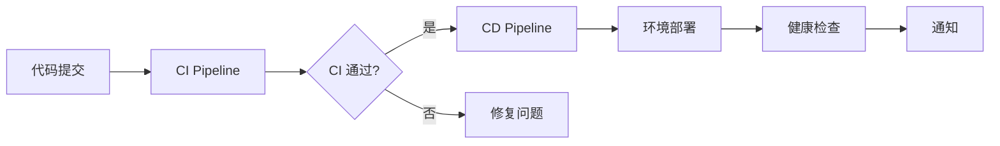

# CI/CD 工作流说明

## 📋 新架构概览

### 🔍 CI Pipeline (`ci.yml`)
**职责**: 代码质量保证和构建验证
- **触发**: 所有 push 和 PR (main, develop, feature/*)
- **包含**: 
  - 代码规范检查 (ESLint, Black, Flake8)
  - 类型检查 (TypeScript, MyPy)
  - 单元测试和覆盖率
  - 安全扫描 (npm audit, safety, CodeQL)
  - 构建验证 (Next.js build, Docker build)

### 🚀 CD Pipeline (`cd.yml`)  
**职责**: 自动化部署和环境管理
- **触发**: 仅在 CI 成功后自动触发
- **包含**:
  - 生产环境部署 (main 分支)
  - 开发环境部署 (develop 分支)
  - 健康检查和验证
  - 部署通知

## ✅ 新架构优势

### 1. **职责分离**
- CI 专注代码质量，CD 专注部署流程
- 更清晰的错误定位和问题诊断

### 2. **性能优化**
- CI 快速反馈 (~5-10分钟)
- CD 只在需要时运行，节省资源
- 并行执行不同环境的测试

### 3. **维护性提升**
- 每个文件 <200行，更易理解
- 独立修改，降低相互影响
- 更精确的权限控制

### 4. **灵活的触发策略**
```yaml
# CI: 广泛触发，快速反馈
on:
  push: [main, develop, feature/**]
  pull_request: [main, develop]

# CD: 精确触发，安全部署
on:
  workflow_run:
    workflows: ["CI Pipeline"]
    types: [completed]
    branches: [main, develop]
```

## 🔄 工作流程



## 🎛️ 分支策略

| 分支 | CI 触发 | CD 触发 | 部署环境 |
|-----|---------|---------|----------|
| `main` | ✅ | ✅ | Production |
| `develop` | ✅ | ✅ | Development |
| `feature/*` | ✅ | ❌ | - |
| `PR` | ✅ | ❌ | - |


## 📊 监控和调试

### CI 状态检查
- 在任何分支推送后，都会触发完整的 CI 检查
- 在 GitHub Actions 页面查看 "CI Pipeline" 工作流

### CD 状态检查  
- 只有在 CI 成功后才会触发 CD
- 在 GitHub Actions 页面查看 "CD Pipeline" 工作流

### 常见问题排查
1. **CD 未触发**: 检查 CI 是否成功完成
2. **权限错误**: 检查 `secrets` 配置是否正确
3. **部署失败**: 查看健康检查日志和 Vercel 部署状态

## 🔧 自定义配置

如需修改触发条件或添加新环境，编辑相应的 `.yml` 文件：
- 修改 CI 检查: 编辑 `ci.yml`  
- 修改部署流程: 编辑 `cd.yml`

