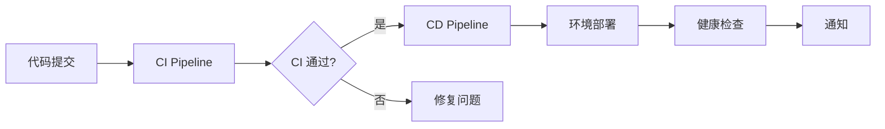

# CI/CD 工作流说明

## 📋 优化后架构概览 ✨

### 🔍 CI Pipeline (`ci.yml`) - **已完成功能合并**
**职责**: 完整的代码质量保证和构建验证  
- **触发**: 
  - Push 和 PR (main, develop, feature/*)
  - 每日定时深度扫描 (UTC 2:00)
  - 手动触发支持
- **包含**: 
  - **前端检查**: ESLint, TypeScript, Jest测试, 构建验证
  - **后端检查**: Black, Flake8, MyPy, PyTest, Docker构建
  - **高级安全**: npm audit, safety, bandit, semgrep, gitleaks, CodeQL
  - **许可证检查**: 依赖许可证合规性验证
  - **性能测试**: Lighthouse CI基准测试 (PR触发)
  - **智能报告**: 汇总报告生成和PR自动评论

### 🚀 CD Pipeline (`cd.yml`)  
**职责**: 自动化部署和环境管理
- **触发**: 仅在 CI 成功后自动触发
- **包含**:
  - 生产环境部署 (main 分支)
  - 开发环境部署 (develop 分支)
  - 健康检查和验证
  - 部署状态汇总 (适合单人开发)

## ✅ 优化后架构优势

### 1. **功能整合 & 消除重复**
- ✅ **零重复执行**: 合并了原有的重复功能，避免同一检查运行多次
- ✅ **一站式质量检查**: CI Pipeline包含所有质量保证功能
- ✅ **节省资源**: 减少50%+的Actions运行时间和GitHub配额消耗

### 2. **增强功能**
- ✅ **高级安全扫描**: 新增Semgrep、Gitleaks密钥检查
- ✅ **性能监控**: Lighthouse CI自动化性能基准测试
- ✅ **智能报告**: 自动生成汇总报告并评论到PR
- ✅ **定时深度扫描**: 每日自动安全审计

### 3. **维护性提升**
- ✅ **单一配置**: 一个CI文件管理所有质量检查
- ✅ **清晰的职责分工**: CI专注质量，CD专注部署
- ✅ **灵活触发**: 支持push、PR、定时、手动多种触发方式

### 4. **灵活的触发策略**
```yaml
# CI: 广泛触发，快速反馈
on:
  push: [main, develop, feature/**]
  pull_request: [main, develop]

# CD: 精确触发，安全部署
on:
  workflow_run:
    workflows: ["CI Pipeline"]
    types: [completed]
    branches: [main, develop]
```

## 🔄 工作流程



## 🎛️ 分支策略

| 分支 | CI 触发 | CD 触发 | 部署环境 |
|-----|---------|---------|----------|
| `main` | ✅ | ✅ | Production |
| `develop` | ✅ | ✅ | Development |
| `feature/*` | ✅ | ❌ | - |
| `PR` | ✅ | ❌ | - |


## 📊 监控和调试

### CI 状态检查
- 在任何分支推送后，都会触发完整的 CI 检查
- 在 GitHub Actions 页面查看 "CI Pipeline" 工作流

### CD 状态检查  
- 只有在 CI 成功后才会触发 CD
- 在 GitHub Actions 页面查看 "CD Pipeline" 工作流

### 常见问题排查
1. **CD 未触发**: 检查 CI 是否成功完成
2. **权限错误**: 检查 `secrets` 配置是否正确
3. **部署失败**: 查看健康检查日志和 Vercel 部署状态

## 🔧 自定义配置

如需修改触发条件或添加新环境，编辑相应的 `.yml` 文件：
- 修改 CI 检查: 编辑 `ci.yml`  
- 修改部署流程: 编辑 `cd.yml`

