# CI/CD 工作流说明

## 📋 当前架构概览 ✨

### 🔄 统一Pipeline (`pipeline.yml`) - **最新架构**
**职责**: CI/CD一体化，单一工作流管理完整流程  
- **触发**: 
  - Push到main、develop分支
  - 手动触发支持 (workflow_dispatch)
- **包含**: 
  - **CI阶段**: ESLint, TypeScript, Jest测试, Next.js构建验证
  - **生产部署**: main分支自动部署到生产环境
  - **开发部署**: develop分支自动部署到预览环境
  - **健康检查**: 部署后状态验证和汇总报告

## ✅ 架构优势

### 1. **简化架构**
- ✅ **单一工作流**: 一个文件管理CI+CD全流程
- ✅ **减少依赖**: 无需workflow_run触发器，避免secrets访问问题
- ✅ **快速反馈**: Push即触发，无等待时间

### 2. **稳定部署**
- ✅ **原生CLI**: 抛弃过时的vercel-action，直接使用最新Vercel CLI
- ✅ **非交互式**: 管道输入自动确认，无卡死问题
- ✅ **智能构建**: 使用无lint构建脚本，避免ESLint版本冲突

### 3. **维护简单**
- ✅ **配置统一**: 所有CI/CD逻辑在一个文件中
- ✅ **问题隔离**: 依赖问题通过package-lock.json同步解决
- ✅ **版本兼容**: 自动使用最新工具版本

## 🔄 工作流程

```mermaid
graph TD
    A[代码Push] --> B[运行CI测试]
    B --> C{CI通过?}
    C -->|是| D{分支检查}
    C -->|否| E[任务失败]
    D -->|main| F[生产环境部署]
    D -->|develop| G[开发环境部署]
    F --> H[前端部署到Vercel]
    F --> I[后端部署到Vercel]
    G --> J[前端预览部署]
    G --> K[后端预览部署]
    H --> L[部署状态汇总]
    I --> L
    J --> L
    K --> L
```



## 🎛️ 分支策略

| 分支 | CI触发 | 部署环境 | 说明 |
|-----|--------|----------|------|
| `main` | ✅ | Production | 生产环境自动部署 |
| `develop` | ✅ | Preview | 预览环境自动部署 |
| `feature/*` | ❌ | - | 需手动合并到develop |

## 🔧 部署技术方案

### Vercel部署配置
```bash
# 直接使用最新Vercel CLI
npm install -g vercel@latest

# 非交互式部署策略
echo "y" | vercel --prod --token "$VERCEL_TOKEN" --confirm || \
vercel --prod --token "$VERCEL_TOKEN" --force --yes 2>/dev/null || \
vercel --prod --token "$VERCEL_TOKEN" < /dev/null
```

### 构建优化
```json
// package.json
"vercel-build-no-lint": "rm -rf .next && ... npx next build"

// vercel.json  
"buildCommand": "npm run vercel-build-no-lint"
```

## 📊 监控和调试

### 状态检查
- 在GitHub Actions页面查看"CI/CD Pipeline"工作流
- 所有阶段在一个工作流中，便于统一监控

### 常见问题排查
1. **CI失败**: 检查ESLint、测试或构建错误
2. **部署卡死**: 已解决，使用管道输入自动确认
3. **构建失败**: 已解决，使用无lint构建脚本
4. **依赖冲突**: 已解决，package-lock.json已同步

## 🚨 已解决的历史问题

| 问题 | 原因 | 解决方案 |
|-----|------|----------|
| workflow_run无法访问secrets | 触发器限制 | 改用push触发器 |
| Vercel CLI交互式卡死 | vercel-action版本过旧 | 直接使用最新CLI + 管道输入 |
| ESLint构建失败 | 版本不匹配 | 更新依赖 + 无lint构建脚本 |
| npm ci失败 | lock文件不一致 | 重新生成package-lock.json |

## 🔮 计划中的功能扩展

### Code Quality 核心类别 (待实现)

#### **1. 代码规范与格式化**
```yaml
前端 (JavaScript/TypeScript):
├── ESLint          # 代码规范检查 ✅ (已有)
├── Prettier        # 代码格式化
├── TypeScript      # 类型检查 ✅ (已有)
└── Stylelint       # CSS/SCSS规范

后端 (Python):
├── Black           # 代码格式化
├── Flake8          # PEP8规范检查
├── isort           # import排序
├── MyPy            # 类型检查
└── pylint          # 综合代码质量
```

#### **2. 单元测试与覆盖率**
```yaml
测试框架:
├── Jest            # 前端单元测试 ✅ (已有)
├── PyTest          # 后端单元测试
├── React Testing   # 组件测试
└── Supertest       # API测试

覆盖率要求:
├── 最低覆盖率      # 通常70-80%
├── 分支覆盖        # 逻辑分支测试
└── 覆盖率报告      # 生成详细报告
```

#### **3. 安全扫描**
```yaml
依赖安全:
├── npm audit       # Node.js依赖漏洞
├── yarn audit      # Yarn依赖检查
├── safety          # Python依赖安全
└── snyk            # 跨平台依赖扫描

代码安全:
├── bandit          # Python安全扫描
├── semgrep         # 多语言安全分析
├── CodeQL          # GitHub高级安全
└── SonarQube       # 综合安全分析

密钥泄露:
├── gitleaks        # Git历史密钥扫描
├── truffleHog      # 密钥模式匹配
└── detect-secrets  # 预提交密钥检查
```

#### **4. 性能与质量指标**
```yaml
性能测试:
├── Lighthouse CI   # Web性能基准
├── Bundle Analyzer # 打包体积分析
├── Core Web Vitals # 用户体验指标
└── Load Testing    # 负载测试

代码质量:
├── 复杂度分析       # 圈复杂度
├── 重复代码检测     # DRY原则
├── 技术债务评估     # 维护性指标
└── 文档覆盖率       # 注释完整性
```

#### **5. 许可证与合规性**
```yaml
许可证检查:
├── license-checker # 依赖许可证扫描
├── FOSSA          # 企业级许可证管理
├── 开源合规       # GPL/MIT等兼容性
└── 法律风险评估   # 商业使用风险
```

### 实现方案
- **阶段1**: 基础安全扫描 (npm audit + gitleaks)
- **阶段2**: 性能监控 (Lighthouse CI)
- **阶段3**: 后端质量检查 (Python工具链)
- **阶段4**: 高级安全分析 (semgrep + CodeQL)

---

## 🔧 自定义配置

如需修改部署流程，编辑 `pipeline.yml` 文件：
- CI检查配置: jobs.run-ci
- 生产部署配置: jobs.deploy-production  
- 开发部署配置: jobs.deploy-development